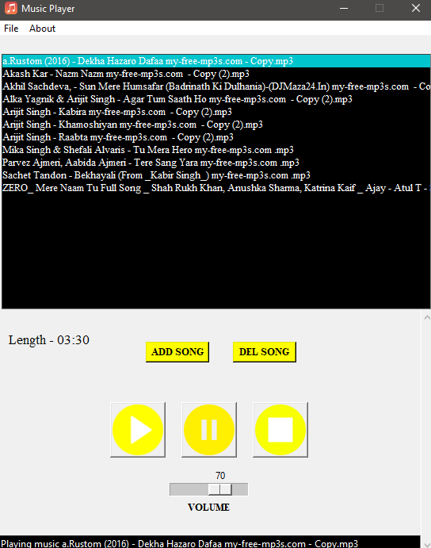

# Music_Player_GUI 🎶👩‍💻
Play music from playlist of your choice

## Code Requirements
- Tkinter(available in python)
- pygame (`pip install pygame`)
- mutagen (`pip install mutagen`)

## About
A simple GUI of Music Player which play songs of the selected playlist.

## Functions
- Play song
- Pause song
- stop song
- Add song
- Delete song
- Volume controller
- Length of song

### --> Play music

## Note
You'll need Python 3.6 as project interpreter in case working on Pycharm.
